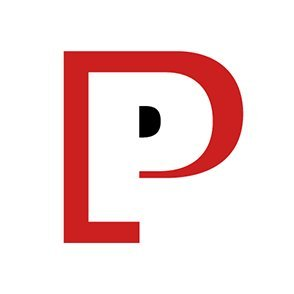
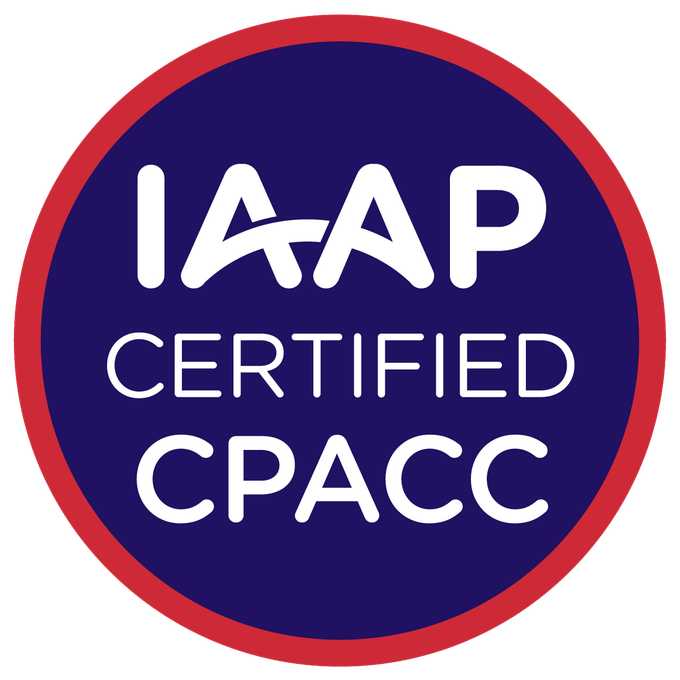

# Welcome to Melissa Spiegel’s Portfolio

## About Me

Hello! I'm Melissa Spiegel, a skilled software engineer with over nine years of experience in full-stack web development and cross-functional team collaboration. Proficient in TypeScript, JavaScript, and Model-View-Presenter (MVP) Design Patterns. Dedicated to improving developer productivity through innovative solutions, robust testing frameworks, and detailed technical documentation.

**Contact Information:**

<table>
  <tr>
    <td valign="top" width="80"></td>
    <td  width="749"><strong>LinkedIn:</strong> <a href="https://www.linkedin.com/in/melissaspiegel/">Melissa Spiegel</a></td>
  </tr>
  <tr>
    <td valign="top" width="80"></td>
    <td width="749"><strong>Email:</strong> mrspiegel@me.com</td>
  </tr>
  <tr>
    <td valign="top" width="80"></td>
    <td width="749"><strong>Location:</strong> Jupiter Farms, Florida USA</td>
  </tr>
    <tr>
    <td valign="top" width="80"></td>
    <td width="749"><strong>GitHub:</strong> 
      <a href="https://github.com/melissaspiegel">Profile for Melissa Spiegel</a></td>
  </tr>
</table>

## Skills

<table>
  <tr>
    <td width="80" valign="top"></td>
    <td>Technologies: TypeScript, JavaScript, Node.js, HTML5, PHP, Python</td>
  </tr>
  <tr>
    <td width="80" valign="top"></td>
    <td>Build Tools: Webpack, Grunt</td>
  </tr>
  <tr>
    <td width="80" valign="top"></td>
    <td>Package Management: npm</td>
  </tr>
  <tr>
    <td width="80" valign="top"></td>
    <td>Versioning: Git, GitHub, GitLab</td>
  </tr>
  <tr>
    <td width="80" valign="top"></td>
    <td>Collaboration: Mob coding, peer code reviews</td>
  </tr>
  <tr>
    <td width="80" valign="top"></td>
    <td>Technical Documentation: Skilled in creating clear documentation</td>
  </tr>
  <tr>
    <td width="80" valign="top"></td>
    <td>Containerization: Docker</td>
  </tr>
  <tr>
    <td width="80" valign="top"></td>
    <td>Code Quality: High standards of code quality and readability</td>
  </tr>
  <tr>
    <td width="80" valign="top"></td>
    <td>Accessibility: WCAG Certified, VoiceOver (VO), Accessibility Conformance Report (ACR)</td>
  </tr>
  <tr>
    <td width="80" valign="top"></td>
    <td>Design Patterns: Model-View-Presenter (MVP)</td>
  </tr>
  <tr>
    <td width="80" valign="top"></td>
    <td>Design Systems: Collaborated with the Indeed WebX Team to develop Indeed's Design System, focusing on architecture and modern CSS design principles</td>
  </tr>
  <tr>
    <td width="80" valign="top"></td>
    <td>CI/CD: GitLab, Jenkins</td>
  </tr>
  <tr>
    <td width="80" valign="top"></td>
    <td>Testing: Unit, PHPUnit, Mocha, Jest, Visual Regression testing with Playwright</td>
  </tr>
  <tr>
    <td width="80" valign="top"></td>
    <td>Linting: ESLint, Stylelint</td>
  </tr>
  <tr>
    <td width="80" valign="top"></td>
    <td>Preprocessing: SASS, LESS</td>
  </tr>
  <tr>
    <td width="80" valign="top"></td>
    <td>Methodologies: Agile, scrum</td>
  </tr>
  <tr>
    <td width="80" valign="top"></td>
    <td>Communication: Strong support skills via Zoom, Slack, and documentation</td>
  </tr>
</table>

## Experience

### Indeed.com - Remote

<table>
  <tr>
    <td width="80" valign="top"></td>
    <td width="749">
      <strong>Software Engineer</strong>  
      November 2022 - May 2024 
      <ul>
        <li>Built Indeed’s Design System focusing on reusable components and modern CSS design principles.</li>
        <li>Integrated WCAG testing into GitLab CI/CD pipelines to enhance accessibility compliance.</li>
        <li>Implemented robust unit and end-to-end visual regression tests.</li>
      </ul>
    </td>
  </tr>
</table>

### Perficient Digital - Remote

<table>
  <tr>
    <td valign="top" width="80"></td>
    <td width="749">
      <strong>Web Developer Contractor for Indeed.com</strong>  
      November 2019 - November 2022 
        <ul>
            <li>Developed and maintained Indeed’s Design System.</li>
            <li>Collaborated with cross-functional teams to implement new features and enhancements.</li>
            <li>Conducted code reviews and mentored junior developers.</li>
        </ul>
    </td>
    </tr>
</table>

### Massachusetts Institute of Technology (MIT) - Cambridge, Massachusetts

<table>
  <tr>
    <td width="80" valign="top"></td>
    <td width="749">
    <strong>Web Developer</strong>  
    May 2016 - November 2019 
      <ul>
        <li>Developed and maintained internal developer documentation, improving accessibility and usability for non-technical staff.</li>
        <li>Engineered content editing solutions specifically designed for non-technical library staff.</li>
      </ul>
    </td>
  </tr>
</table>

## Certifications
<table>
  <tr>
    <td width="80" valign="top"></td>
    <td width="749">
      <strong>Certified Professional in Accessibility Core Competencies (CPACC)</strong>  
      <em>IAAP - International Association of Accessibility Professionals</em> 
      Issued Mar 2022 · Expires Mar 2025 
      <a href="https://www.credly.com/badges/460a39e0-ae3a-46eb-8e42-c5ab42ed919f">View Credential</a>
    </td>
  </tr>
</table>

## Education

<table>
  <tr>
    <td width="80" valign="top">
      
    </td>
    <td width="749">
      <strong>Bachelors of Science (BS)</strong> 
      University of Massachusetts - Lowell, Massachusetts
    </td>
  </tr>
</table>
